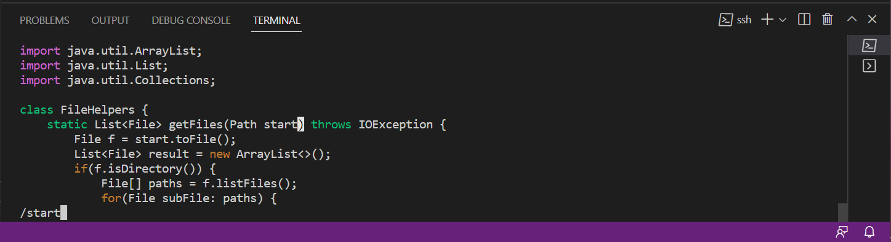
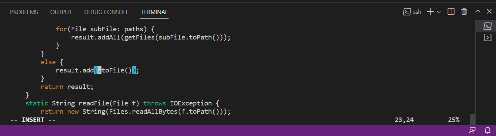
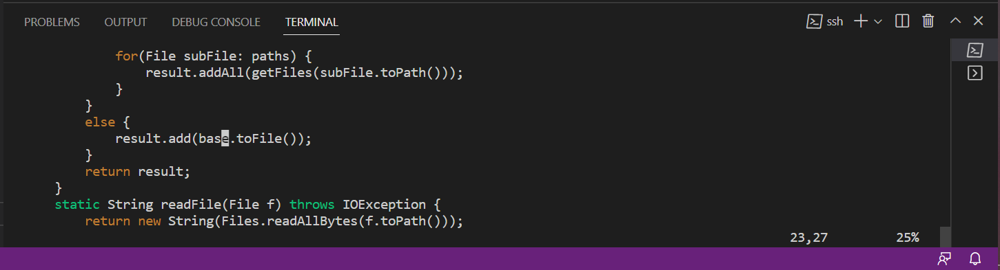
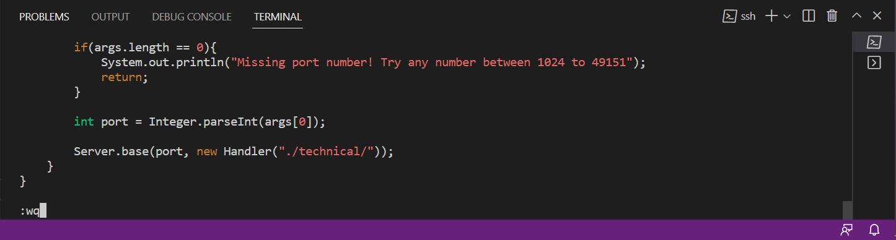

## Lab Report 4
> # Part 1
> The list of commands I would press to change the word start to base using vim:
> /start< Enter >cebase< Esc >n.n.n.:wq (n. is for repeating the exact same past commands)
> 
  /start
  
  ce
  
  base<ESC>
 
  n.:wq
  
> # Part 2
> Time using scp: 5:12
> Time using vim: 3:57
  Even though I am more used to using scp through the practice we have had in lab, using vim to edit was a lot easier because of the shortcuts that I could use.
  It also helped to already be logged onto the remote server so that I didn't have to log in multiple times and could immediately run the script. 
  Question reponse: I think I am starting to prefer using vim instead of doing my edits elsewhere and then copying them over. Although sometimes its  hard to remember all of the different options, overall the process can be very efficient once you're familiar with it. I think that if I were to have to make big changes to a file such as rewriting an entire method I might do the editing regualrly without vim, however, for most of the cases where I only need to change certain words or want to test out different implementations I would use vim. Altogether though, I really like the efficiency of vim and the ability to move around the programs quickly which is why I may chose to use it often. 
  
