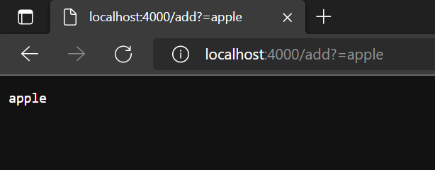

# Week 3 Lab Report 
## Part 1
```
class Handler implements URLHandler {
    // The one bit of state on the server: a number that will be manipulated by
    // various requests.
    ArrayList<String> s = new ArrayList<>();

    public String handleRequest(URI url) {
            System.out.println("Path: " + url.getPath());
            if (url.getPath().contains("/add")) {
                String[] parameters = url.getQuery().split("=");
                    s.add(parameters[1]);
                    return parameters[1];
            }
            else if (url.getPath().contains("/search")){
                String[] parameters = url.getQuery().split("=");
                for (String strs: s){
                    if (strs.contains(parameters[1])){
                        return strs;
                    }
                }

            }
            return "404 Not Found!";
        }
    }
    class SimpleServer {
        public static void main(String[] args) throws IOException {
            if(args.length == 0){
                System.out.println("Missing port number! Try any number between 1024 to 49151");
                return;
            }
    
            int port = Integer.parseInt(args[0]);
    
            Server.start(port, new Handler());
        }
    }
 ```
   
    In this image the methods that are called are the handleRequest method that takes in the URL and uses if statement for the different inputs. Since this one is add, the input string gets added to the "s" arraylist and is stored for use later. 
    
    This image also uses the add function which calles the handleRequest method that takes in the URL and get's the value of what we are adding by checking the add command and then spliting the url to get the string we are meant to add. It is then added to the arraylist and stored like the last image.
    
    This image is using search which calls handleRequest again to process the URL and then goes into the Search if-statement that comapres the value of the string to search with all other values in the list.
   >
   ## Part 2
   Failure inducing Inputs:
   1. int[] input1 = { 3, 4, 5, 6 };
ArrayExamples.reverseInPlace(input1);
assertArrayEquals(new int[]{ 6, 5, 4, 3 }, input1);

2.double[] input2 = { 5.0, 1.0, 2.0, 4.0, 1.0 };
    double output = ArrayExamples.averageWithoutLowest(input2);
    assertEquals(3.0, output, 0);


Symptoms:
1. Index 3 is supposed to be 3 but is 6
2. Should return 3.0 but returns 2.75


Bugs/reasoning:
1. The bug is here: arr[i] = arr[arr.length - i - 1];
Here the values are only being shifted rather than swaped and the first element gets overwritten which then messes up the rest of the swap. 
2.The bug is here: if(num != lowest) { sum += num; }
This gets rid of all lowest numbers including repeats which gives the wrong value. 


    
  
    
