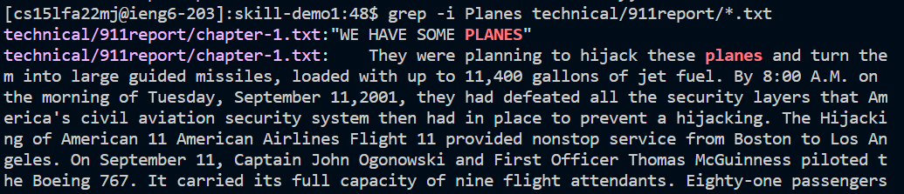

# Lab Report 3 for Week 5
The command that I chose to do more research on was 'grep'. I found 3 different new command line options which are as follows:
## grep -i 
> 
The -i option ignores the case for the word to be searched 
> examples:
> 

## grep -w
>
The -w option allows you to search for full words instead of words containing the given string 

## grep -h
>
The -h options represses file names in the output
