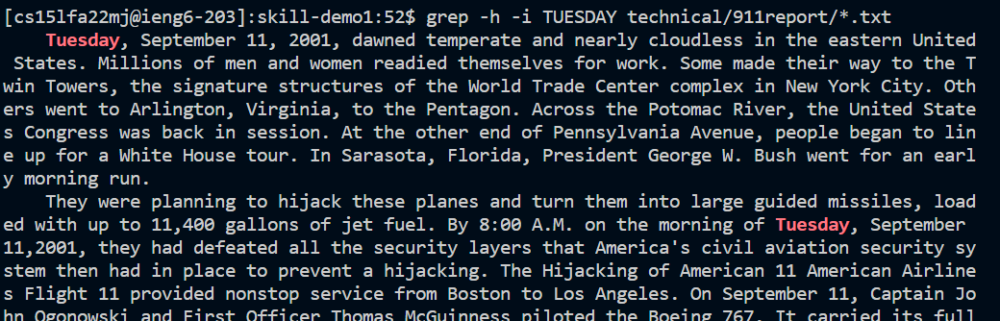

# Lab Report 3 for Week 5
The command that I chose to do more research on was 'grep'. I found 3 different new command line options which are as follows:
## grep -i 
> 
The -i option ignores the case for the word to be searched 
> examples:
> 
> In this example I searched for Planes with the first letter capitalized to show that the title and other words still show up with different cases. As you can see the fully lowercase word and the fully uppercase word show up in the output.
> 
> In this example I wanted to show searching something up fully in uppercase. The case was ignored again in the output. This is helpful because I might have used all uppercase on accident since the titles in the last document were in all uppercase but using -i gets rid of that issue.
> 
> Lastly, in this example I showed using random caplitalization thoughout the word and the command still works. Ignoring the case in these examples is important because sometimes things like the headers or titles include different caplitalization than body paragrpahs. If we didn't ignore the case these words in the headers would be ignored. It also helps us save time because we don't need to rewrite each case to test with different capitalization.

## grep -w
>
The -w option allows you to search for full words instead of words containing the given string 
> examples:
> 
>  In this example I combined both grep -w and the last command option -i to show how to combine the two for a faster and more accurate output. In this case, Tuesday is a full word on it's own so the same output shows up as in the last section, however, we can verify here that the full word is searched not just a part. 
> 
> In this example I wanted to look up Plane since this text contained the word plane as well as planes. Although the occurences of planes were further down in the text, the output shown here still shows that the entire word was searched for which helps reduce the number of searches if I were to search for "plane" and then "planes".
> 
> In this last example I combined -w and -i again to shorten the amount of commands I had to type. Although not seen in this example four would also search for instaces such as fourty-four which occur further down which helps with efficiency. 
## grep -h
>
The -h options represses file names in the output
> examples:
> 
> In this example, I combined -h and -i to search for all the occurences of planes regardless of case while also repressing file names. This is useful because I could do this all in one line and the searched words are easily recognizable in the output since the only color coded word is that which we searched.
> 
> In this example I combined -h and -i again for the most concise command line prompts. The output look much neater without the file names which would be especially useful if you're search within just one file.
> 
> In this example I combined -h and -i again with -h helping us minimize the output when the file names are not needed and save space. With large outputs this can save us memory. 
