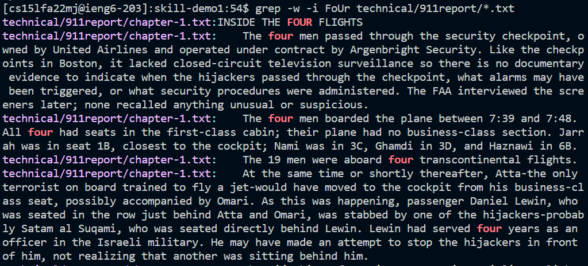

# Lab Report 3 for Week 5
The command that I chose to do more research on was 'grep'. I found 3 different new command line options which are as follows:
## grep -i 
> 
The -i option ignores the case for the word to be searched 
> examples:
> 
> 
> 
> Ignoring the case in these examples is important because sometimes things like the headers or titles include different caplitalization than body paragrpahs. If we didn't ignore the case these words in the headers would be ignored. It also helps us save time because we don't need to rewrite each case to test with different capitalization. In these examples I tried different types of capitalization to see if the -i option worked in each situation and it did. 

## grep -w
>
The -w option allows you to search for full words instead of words containing the given string 
> examples:
> 
> 
> 
> The -w command option is helpful by allowing you to search for whole words only. This is important for example if there are many words that contain a string in it such as "plane" vs "planes". This option helps us differentiate between the two easily. 

## grep -h
>
The -h options represses file names in the output
> examples:
> 
> 
> 
> The -h option is very helpful for minimizing the output especially of the individual file names are not needed. This would be helpful if we were search within just one file or if we did need the file names and wanted to save some space. 
