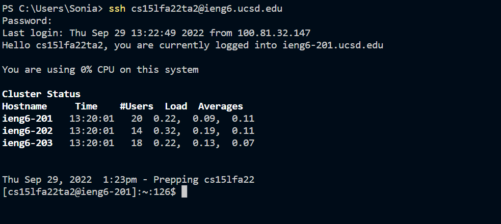

# Hello incoming CS15L students! Here is your cheat sheet for remote access (FOR WINDOWS)

## Installing VS Code
>
First, instal vs code on your personal device by going to  (https://code.visualstudio.com/)
Next, install OpenSSH in the apps section of settings through the optional features button

## Remotely Connecting
After, step up your CS account and password at (https://sdacs.ucsd.edu/~icc/index.php)
Next, try signing into the remote server using ssh cs15lfa22zz@ieng6.ucsd.edu on your terminal  (it may take a while for the password to work) 
You should see something that looks like this after logging in  

## Now you can start trying out some commands!
Some to start with are:
cd~ (changes directory to home)
cd (changes directory)
ls (list)

## Moving files with scp 
Once that works you can try copying files into your remote server. To see what files you currently have in your directory use the ls command
First change to your home directory using cd~
Next create your file and save it somewhere on your personal computer
After, use scp <file path> <where to copy to (cs15lfa22zz@ieng6.ucsd.edu:~/)>
Now you can log into the remote server and list the files. You should see the one you have just copied
  
## Setting up SSH keys
Now you are ready to use SSH keys to make this login process easier!
  Unfortunately I was unable to log in to my own account and did the rest of this lab on the temporary TA account so I did not want to set up keys with that account. 
  The steps however on Windows is to first type in this command to generate your keys <ssh-keygen -t zzzzzz> (the z's will be replaced by a unique code for your key). This will then generate your keys and ask you where you would like to save them. 
  The next step is to scp your public key onto the remote server. 
  Once you have done this you don't have to enter your password everytime!
  
 ## Optimizing remote running
  Remote running is a lot faster using SSH keys so you don't have to re-type your password every time. 
  Some other helpgul tips to make copying faster is to run multiple commands at once using ";" or by using the up arrow to rerun commands you have already written!
  
  Good luck!
 

